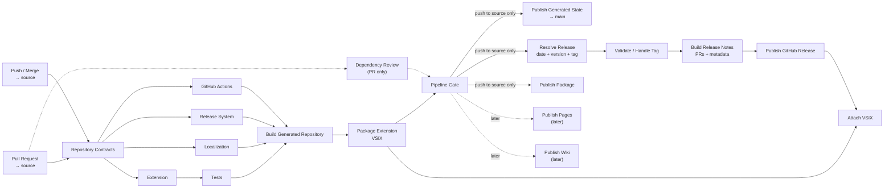

# Automation

`CI` validates pull requests and source pushes as distinct jobs, then publishes
the generated repository and VSIX files as immutable workflow artifacts. A
successful source push triggers the separate `Publish` workflow, which updates
`main` from the validated repository artifact.

Release publication is declared in `releases/publication.json`. The release
resolver validates the record, extension version, and tag on every run. GitHub
Release creation, VSIX attachment, and Marketplace publication occur only when
`enabled` is `true`; Marketplace publication additionally requires the
`VSCE_PAT` repository secret.

Pages and Wiki publication are reserved for later work and are not represented
by placeholder jobs.
